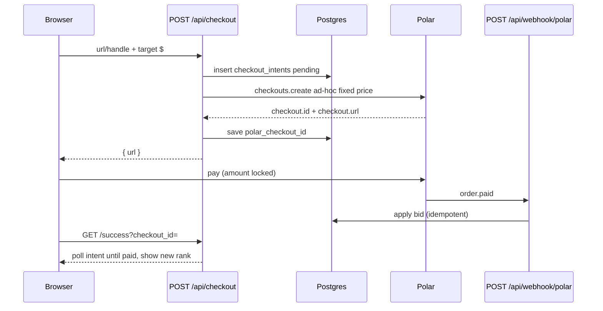

# Spec: schema + Polar checkout

Polar’s current API: **one catalog product**, **ad-hoc fixed price per checkout**, **metadata on the session**, **`order.paid` as source of truth**.

Do **not** use Polar pay-what-you-want. The buyer could change the amount on Polar’s page and skip your rank math.

## Architecture

Two tables you own. Polar only takes money.

```
form → checkout_intents (pending) → Polar Checkout (locked $)
                                         ↓
                                   order.paid webhook
                                         ↓
                              listings upsert + bid_events
```

**Rank is never reserved.** Whoever paid sits at that dollar amount. If #1 moved while they were on Polar, they still land — just lower. Never refund a completed payment because the throne moved.

Polar metadata limits: keys ≤40 chars, values ≤500 chars, ≤50 pairs. **Do not put the listing description in Polar.** Put `intent_id` only.



---

## Polar dashboard (once)

1. Sandbox org first. Product: **one-time**, name `Board listing`. Catalog price can be $1 — you override it every session.
2. Organization Access Token with checkout + order scopes.
3. Webhook `https://your.domain/api/webhook/polar`, format **Raw**, events:
   - `order.paid` (required)
   - `order.refunded` (optional — ignore for v1)
4. Discount codes **off** on the product. Also pass `allowDiscountCodes: false` on the session.
5. Local: `polar listen http://localhost:3000/` then point the webhook at the forwarded URL.

Copy [../env.example](../env.example).

Docs: [Checkout sessions](https://polar.sh/docs/features/checkout/session), [Next.js adapter](https://polar.sh/docs/integrate/sdk/adapters/nextjs), [Webhooks](https://polar.sh/docs/integrate/webhooks/endpoints).

---

## Product rules (match overbid.lol)

From their Polar checkout copy:

- overbid is a public leaderboard. Rank **is** the bid — nothing else.
- Bids are whole US dollars.
- Paying less than #1 still puts you on the board at whatever rank that bid can take.
- Enter the same website or @handle again to raise that listing. You only pay the **difference**.
- Someone else **cannot** take your rank by paying that difference. They pay a new full bid higher than yours.
- App Store, Play Store, GitHub, and similar platform links are keyed by **path**, so different apps don’t share a bid.
- Tracking query strings are ignored.
- Chat/invite links are not allowed (Telegram, WhatsApp, Discord, Messenger, Signal).
- Affiliate / referral / tracking URLs will not work — query params are stripped from listing links.
- A completed payment is what claims the rank.
- Clicks go to the submitted URL/profile **without** extra query params except your `utm_source`.

Tax: Polar MoR may add VAT **on top**. Rank uses the bid they typed (`target_bid_cents`), **not** `order.amount`.

---

## Schema

See [../schema.sql](../schema.sql). Amounts are **integer cents**. Rank is a query, not a column.

```sql
select
  row_number() over (order by bid_cents desc, updated_at asc) as rank,
  *
from listings;
```

Tie-break: same dollars → whoever got there **first** stays above.

---

## Identity

Exactly one of URL or `@handle`.

**URL → `identity_key`**

- Require `http(s)`
- Lowercase host, strip `www.`
- Strip trailing `/`, hash, `utm_*` / `ref` / `fbclid`
- Reject `localhost`, `javascript:`, raw IPs, chat-invite hosts
- Store/platform paths **kept** (`apps.apple.com/app/id123` ≠ `id456`)
- Key = `https://host/path` (no trailing slash, no tracking query)
- Click target = that URL + `utm_source=YOURDOMAIN`

**Handle → `identity_key`**

- `^@[A-Za-z0-9_]{1,15}$` → key = `@handle` lowercase
- Click target = `https://x.com/{handle}?utm_source=YOURDOMAIN`

Same key = same row = **upbid**, not a second listing.

Implementation: [../snippets/identity.ts](../snippets/identity.ts).

---

## Bid math (before Polar)

User types a **target total** in dollars (UI: “Claim #1 for $1017”), not a delta.

```
MIN_CENTS = 100
STEP      = 100

target_cents = dollars * 100
existing     = listings where identity_key = key

if existing:
  if target_cents <= existing.bid_cents → reject "must beat your current $X"
  pay_cents = target_cents - existing.bid_cents
else:
  if target_cents < MIN_CENTS → reject
  pay_cents = target_cents
```

Claim-this-rank helper (UI only):

```
to_take_rank_n = listings[n].bid_cents + STEP
```

Empty board → #1 costs $1.

Do **not** require `target >= current_#1 + 1` for a valid payment. A $40 bid on a $1000 board is valid. It sits at whatever rank $40 buys. That fills the screenshot on day one.

---

## `POST /api/checkout`

Collect everything **on your form**. Polar page is payment only.

Do **not** use `@polar-sh/nextjs` `Checkout()` GET helper — it has no ad-hoc `prices` map.

```ts
const checkout = await polar.checkouts.create({
  products: [process.env.POLAR_PRODUCT_ID!],
  prices: {
    [process.env.POLAR_PRODUCT_ID!]: [
      {
        amountType: "fixed",
        priceAmount: intent.pay_cents, // 5000 = $50.00
        priceCurrency: "usd",
      },
    ],
  },
  metadata: { intent_id: intent.id },
  successUrl: `${process.env.NEXT_PUBLIC_APP_URL}/success?checkout_id={CHECKOUT_ID}`,
  returnUrl: process.env.NEXT_PUBLIC_APP_URL,
  allowDiscountCodes: false,
  customerIpAddress:
    req.headers.get("x-forwarded-for")?.split(",")[0]?.trim() ?? undefined,
});
```

Full file: [../snippets/polar-checkout.ts](../snippets/polar-checkout.ts).

Forward `customerIpAddress` so tax/country is the **buyer**, not your Vercel region.

Then return `{ url: checkout.url }` and redirect.

---

## `POST /api/webhook/polar`

```ts
export const POST = Webhooks({
  webhookSecret: process.env.POLAR_WEBHOOK_SECRET!,
  onOrderPaid: async (payload) => {
    await applyPaidOrder(payload.data);
  },
});
```

Full file: [../snippets/polar-webhook.ts](../snippets/polar-webhook.ts).

Read `metadata.intent_id` off the order, or `polar.checkouts.get({ id: order.checkoutId })`.

**Never insert a listing on `checkout.created` or `checkout.updated`.** Unpaid sessions would pollute the board.

Success page is UX only. Poll until `paid`. If they close the tab, the webhook still applies.

---

## Apply (the only write that matters)

One transaction. Idempotent on `polar_order_id`. Full SQL: [../snippets/apply-paid-order.sql](../snippets/apply-paid-order.sql).

```
ON CONFLICT (identity_key) DO UPDATE
  bid_cents = listings.bid_cents + excluded.bid_cents
```

Correct for both:

- first listing: insert at `pay_cents` (= target)
- upbid: add the delta they just paid

Do **not** set `bid_cents = target_bid_cents` blindly. If two upbids race, additive is money-true.

---

## Click-out

`GET /r/[id]` → increment `click_count` → `302` to url with `utm_source`.

MVP: no unique-IP. Add later if people farm it.

---

## Read API

`GET /api/board` — no auth, cache 2s.

```
{
  listings: [{ rank, identity_key, url, title, description, bid_cents, click_count, updated_at }],
  next_to_claim_1_cents: (max_bid ?? 0) + 100
}
```

Client refresh every 3–5s. No websockets for v1.

---

## Routes

| Method | Path | Role |
|---|---|---|
| GET | `/` | Board + bid form |
| POST | `/api/checkout` | Validate, intent, Polar session |
| POST | `/api/webhook/polar` | `order.paid` → apply |
| GET | `/api/board` | Ranked list |
| GET | `/api/intents?checkout_id=` | Success-page poll |
| GET | `/r/[id]` | Click + redirect |
| GET | `/success` | “You’re on the board” |

---

## Edge cases

| Case | Behavior |
|---|---|
| Two people pay $100 for empty #1 | Both at $100. Earlier `updated_at` ranks higher. Next needs $101. |
| Intent for #1 at $50, #1 is $200 when they pay | Insert at $50. No refund. |
| Same URL, two pending checkouts | Both can pay. Both add. |
| Polar tax | Buyer pays bid + tax. Board shows typed bid. |
| Discount code | Disabled. |
| `/success` without paying | Intent `pending`. Don’t list them. |
| Webhook retry | `polar_order_id` unique. No-op. |
| Refund | v1: leave them on the board. |
| Empty title | After paid, optional OG fetch. Don’t block checkout. |
| Seed | SQL insert your listing at $10, skip Polar. |

---

## Do not build in 3 hours

Accounts, Polar customer portal, seats, subscriptions, custom Polar fields for the URL, reserving rank, websockets, admin, “confirm you own this domain.”

Form on your site → locked Polar dollar amount → webhook upsert. That’s the product.
